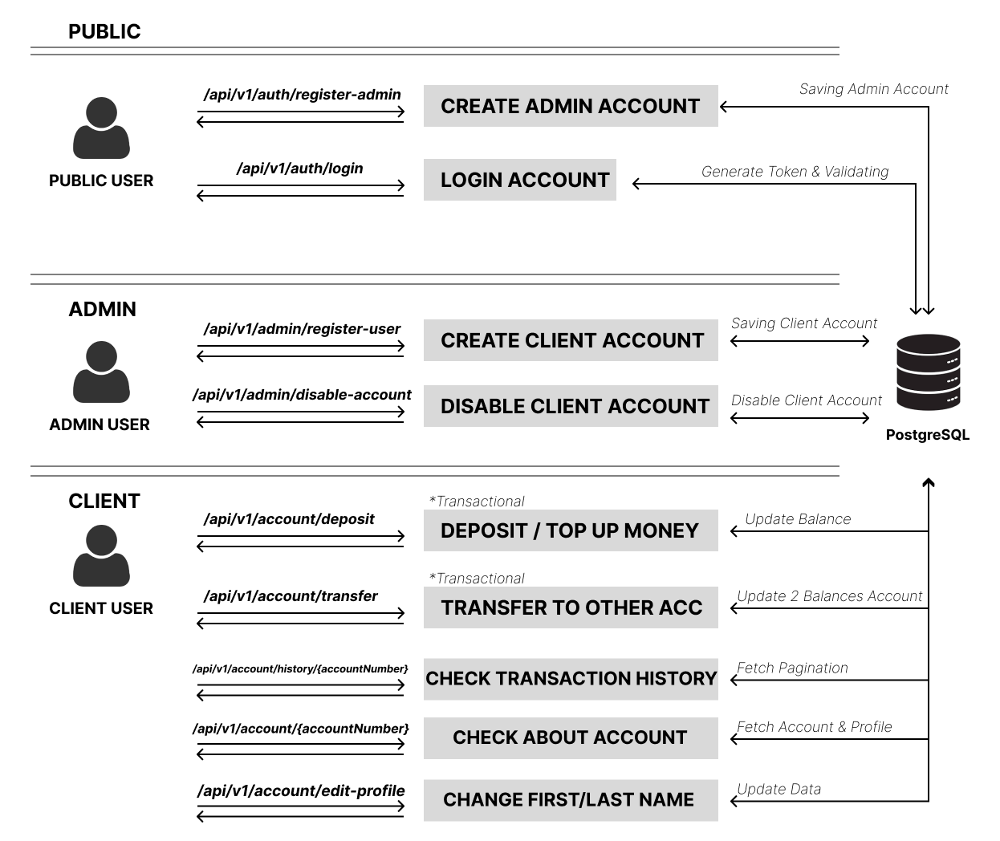
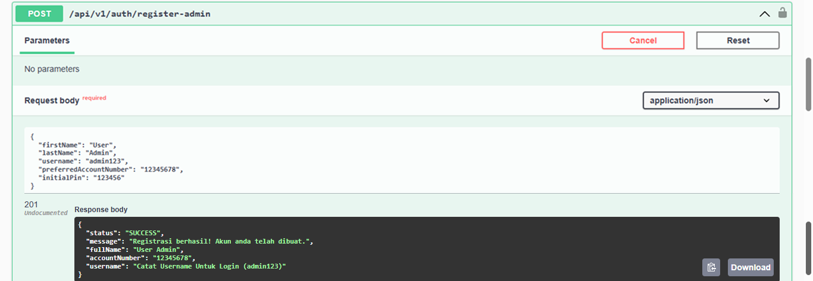
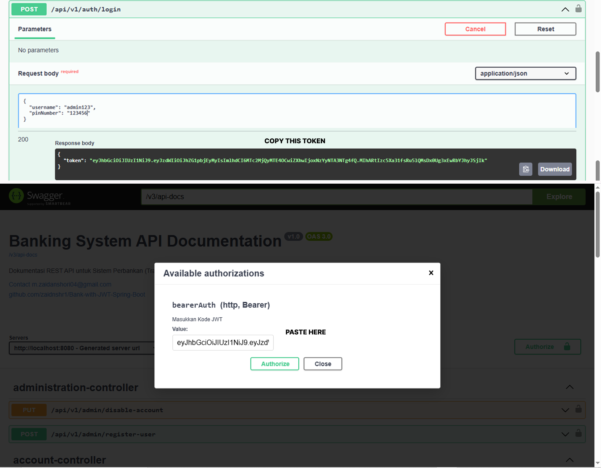
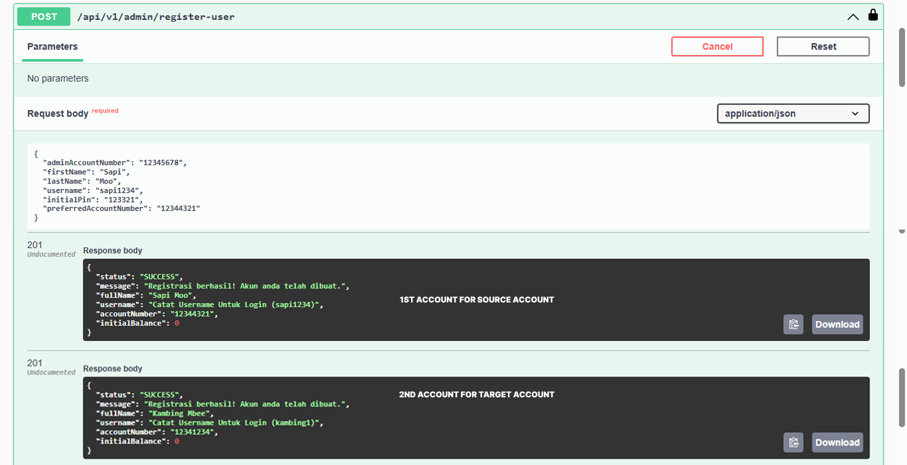
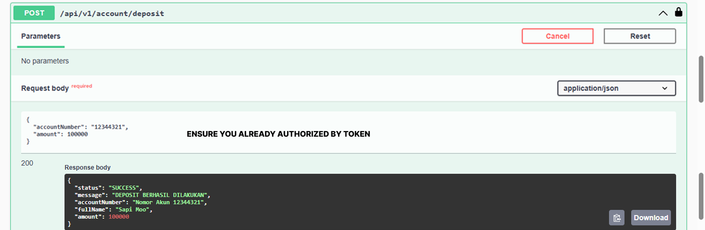
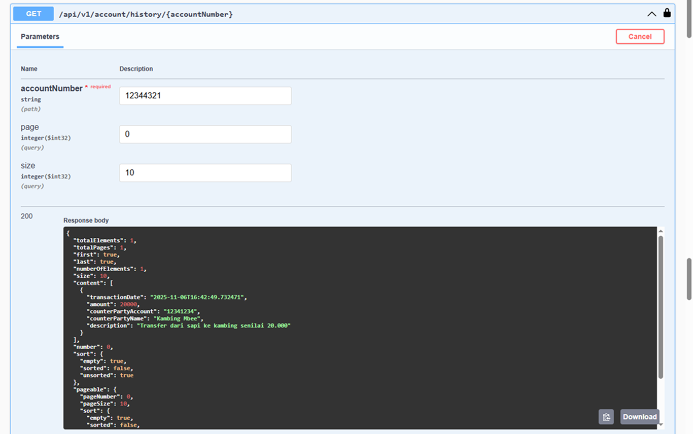
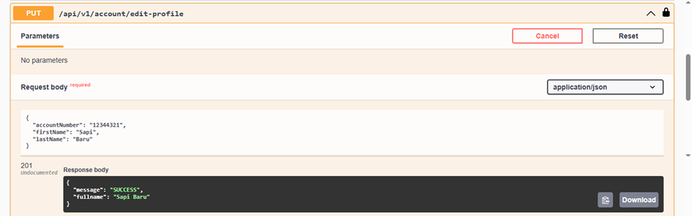

# Banking API using Spring Boot, Spring Security, and JWT

A simple yet secure banking REST API built with Spring Boot, featuring JWT authentication, role-based access control, and transaction management. This project demonstrates backend development principles like layered architecture, secure authentication, database integration, clear documentation.

---

## Tech Stack

- Java 21
- Spring Boot 3
- Spring Security (JWT)
- Spring Data JPA (Hibernate)
- PostgreSQL
- Maven
- Lombok
- Validation & Exception Handler
- JUnit & Mockito
- Springdoc-OpenAPI (Swagger)

---

## ⚙️ How to Run

```bash
# 1. Clone the repository
git clone https://github.com/zaidnshr1/BankingApp.git
cd BankingApp

# 2. Configure database & JWT Key in application.properties
spring.datasource.url=jdbc:postgresql://localhost:5432/yourdb (also create a database in your postgres)
spring.datasource.username=youruser
spring.datasource.password=yourpass
spring.jpa.hibernate.ddl-auto=update
spring.jpa.show-sql=true
application.security.jwt.secret-key=404E635266556A586E3272357538782F413F4428472B4B6250645367566B5970
application.security.jwt.expiration=86400000

# 3. Build the project
mvn clean install

# 4. Run the application
mvn spring-boot:run

# 5. Go to the PostgreSql
insert into roles (id, name) values (1, ROLE_CLIENT), (2, ROLE_ADMIN);
```

Server runs at:
👉 [http://localhost:8080](http://localhost:8080)


## 🚀 Main Endpoints

### 🔓 Public

POST  `/api/v1/auth/register-admin` Register Admin account  
POST  `/api/v1/auth/login`  Authenticate and receive JWT token  

### 🔒 Private (Requires JWT)

## Admin (Jwt From Login Admin)
POST   `/api/v1/admin/register-user`  Admin Register Client account  
PUT   `/api/v1/admin/disable-account`  Admin Disable Client Account  

## Client (Jwt From Login Client)
POST  `//api/v1/account/deposit`  Client can deposit money  
POST  `/api/v1/account/transfer`  Transfer to another accounts  
GET   `/api/v1/account/history/{accountNumber}`  View transaction history  
GET   `/api/v1/account/{accountNumber}`  View Account details  
PUT   `/api/v1/account/edit-profile`  Update first or last name  
  
  
# 📷 DOCUMENTATION

## Creating Admin Account  
#### the constraints:  
- firstName : Not Null
- lastName : Not Null
- username : 8 characters
- preferredAccountNumber : 8 characters
- initialPin : 6 characters
##### 1st, you can try to create an Admin account. it's public for easily setup purposes. As Admin, you can creating and disable the Client Account.



## Admin Login  
#### the constraints:  
- username : Not Null
- initialPin : Not Null
##### 2nd, if you want to create client account and then having transaction, you need the client account. To have client account, you need to create it as Admin. So, please login as Admin first :
- Go to POST  `/api/v1/auth/login`
- Put the right username and pinNumber you already create before.
- Server will validating and generating the token if you pass the right username & password.
- Copy the token and scroll up to Authorize, click the button and paste the token for authorize.


## Admin Creating Client Account  
#### the constraints:  
- adminAccountNumber : Not Null
- firstName : Not Null
- lastName: Not Null
- username : 8 Characters
- initialPin : 6 Characters
- preferredAccountNumber : 8 Characters
##### 3rd, Creating the 1st client account. After that, you can have the initial balance which 0.


## Client Login  
#### the constraints:  
- username : Not Null
- initialPin : Not Null
##### 4th, Right now you are not will be admin anymore. You need being a client to have a transaction. So :
- Go to POST  `/api/v1/auth/login` again
- Gain the token
- Remove the Admin token you login before, chane it by paste the client token


## Deposit Money  
#### the constraints:  
- accountNumber : Not Null
- amount : Not Null
##### 5th, You want to have a transaction right? you need money to transaction. So, you can deoposit goto POST `//api/v1/account/deposit`


## About Account/Profile 
##### 6th, after deposit if you want to see your wallet is topped up or not just hit GET `/api/v1/account/{accountNumber} and you will see the money already added or not.


## Transfer To Another Account  
#### the constraints:  
- sourceAccountNumber : 8 Characters
- targetAccountNumber : 8 Characters
- amount: Not Null
- description : nullable
##### 7th, Now, you can transaction to another account if you know the target accountNumber.
- Go to POST `/api/v1/account/transfer`
- Make sure, if you want to transfer a person dont leave less than 15000 in your bank. It will rollback.
- If success, the your transaction has recorded into transaction history


## View Transaction History  
#### the constraints:  
- accountNumber : 8 Characters
- page : (auto 0 or 1st page)
- size: (auto 10 per page)
##### 8th, After having transaction you can see the proof or history in GET `/api/v1/account/{accountNumber}`


## Change First / Last Name
##### 8th, User can change the first or last name.



